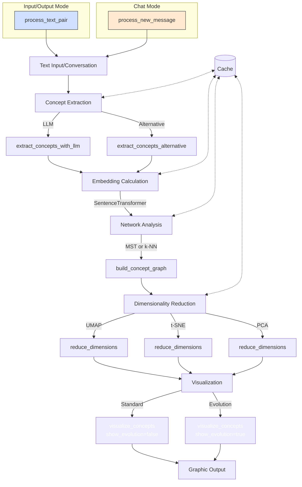

# Prompt Rover - Tracing LLM Latent Space through prompting

## Overview
`PromptRover` is a tool for extracting, analyzing, and visualizing concepts from texts interactively. By using embedding techniques, dimensionality reduction, and graph visualization, it allows users to explore semantic relationships between concepts in different textual contexts.
This repository contains the code from the talk “AI Intuition: Exploring Language Model Latent Space”.
You can view the accompanying slides here:
https://www.canva.com/design/DAGoEGv7WRY/SiP8NIUORZucTXbMSUGTmg/view?utm_content=DAGoEGv7WRY&utm_campaign=designshare&utm_medium=link2&utm_source=uniquelinks&utlId=hc870d079bf

## Key Features

- **Concept Extraction**: Automatic extraction of key concepts from texts using language models (spaCy or OpenAI)
- **Semantic Embedding**: Conversion of concepts into semantic vectors using SentenceTransformer
- **Interactive Visualization**: Two-dimensional representation of concepts with UMAP, t-SNE, or PCA
- **Graph Analysis**: Construction and visualization of concept graphs based on similarity
- **Input/Output Mode**: Comparison between concepts in input and output texts
- **Chat Mode**: Visualization of concept evolution during a conversation

## Requirements

- Python 3.7+
- Main dependencies:
  ```
  sentence-transformers
  spacy
  networkx
  umap-learn
  matplotlib
  pandas
  gradio
  ```
- spaCy models (use `python -m spacy download it_core_news_sm` or equivalent)
- Optional: OpenAI API key for advanced concept extraction

## Usage

### Via Gradio Interface

1. Run `run_in_colab()` in Google Colab or launch the main script
2. Use the interface for:
   - **Input/Output Mode**: Enter input and output texts to compare concepts
   - **Chat Mode**: Converse and see the evolution of concepts in messages

### Via Python API

```python
from concept_transform import ConceptTransformationVisualizer

# Initialization
visualizer = ConceptTransformationVisualizer(
    embedding_model="paraphrase-multilingual-MiniLM-L12-v2",
    openai_api_key="your_api_key"  # Optional
)

# Input/Output Mode
df, fig, status = visualizer.process_text_pair(
    input_text="input text",
    output_text="output text",
    use_llm=True,  # Use OpenAI for concept extraction
    dim_reduction="umap"  # or "tsne", "pca"
)

# Custom Visualization
fig = visualizer.visualize_concepts(
    df,
    show_evolution=False,
    title="My Custom Visualization"
)
```

# Flow Diagram: ConceptTransformationVisualizer



## Flow Description

1. **Input**: The process begins with a text or conversation message
   - In Input/Output mode: processing of two separate texts
   - In Chat mode: processing of sequential messages

2. **Concept Extraction**: Identification of key concepts from the text
   - LLM Method (`extract_concepts_with_llm`): Uses OpenAI for advanced extraction
   - Alternative Method (`extract_concepts_alternative`): Uses spaCy for local extraction

3. **Embedding Calculation**: Transformation of concepts into semantic vectors
   - `compute_embeddings`: Processes both the name and description of each concept

4. **Network Analysis**: Construction of a graph based on relationships between concepts
   - `build_concept_graph`: Creates an MST (Minimum Spanning Tree) or k-NN graph

5. **Dimensionality Reduction**: Projection of embeddings into 2D space
   - `reduce_dimensions`: Implements UMAP, t-SNE, or PCA based on preference

6. **Visualization**: Creation of the final graphic
   - `visualize_concepts`: Unified method with support for temporal evolution
   - Standard output or with temporal evolution (for Chat mode)

7. **Cache**: Storage of intermediate results to optimize performance
   - Reuse of concepts, embeddings, graphs, and projections when possible

This flow applies to both Input/Output mode (via `process_text_pair`) and Chat mode (via `process_new_message`), with differences in state management between sequential messages.

## Code Structure

- **Concept extraction**: `extract_concepts_with_llm()` and `extract_concepts_alternative()`
- **Embedding management**: `compute_embeddings()`
- **Graph construction**: `build_concept_graph()`
- **Dimensionality reduction**: `reduce_dimensions()`
- **Visualization**: `visualize_concepts()` (unified)
- **Process flows**: `process_text_pair()` and `process_new_message()`
- **Interface**: Functions for Gradio integration

## Recent Improvements

1. **Chat response based on conversation**:
   - Generates contextual responses rather than static ones in chat mode
   - Fallback to predefined variable responses if OpenAI is not available

2. **Improved error handling**:
   - API call timeout management
   - Automatic fallback to alternative methods
   - Detailed error logging

3. **Centralized OpenAI initialization**:
   - Unified `initialize_openai_client()` method
   - Consistency in API key management

4. **Coherent caching system**:
   - Cache for concepts, embeddings, dimensional reductions, and graphs
   - Reuse of dimensional reducers when possible
   - Parameterized cache keys

5. **Unified visualization**:
   - `visualize_concepts()` method that replaces previous separate methods
   - Standardized constants for colors and column names
   - Robust column name management for backward compatibility

6. **Performance monitoring**:
   - `log_execution_time` decorator for tracking function performance
   - Detailed logging with different categories (performance, visualization, chat)


## Future Developments

- Further refactoring for modularity
- Automated test suite
- Improved multilingual support
- Multi-text comparison mode
- Export of graphs and results
- Enhanced dynamic visualization with concept highlighting related to the targeted message (on hover)

## Notes for Testers

When verifying the visualization, consider:

1. **Readability**: Are labels, colors, and layout easily interpretable?
2. **Semantic coherence**: Do similar concepts appear close in the graph?
3. **Graph effectiveness**: Do connections reflect meaningful relationships?
4. **Performance**: Does the system respond in reasonable times with texts of different sizes?
5. **User experience**: Are the interface and visualizations intuitive?

Feedback on these aspects will be valuable for future improvements.
